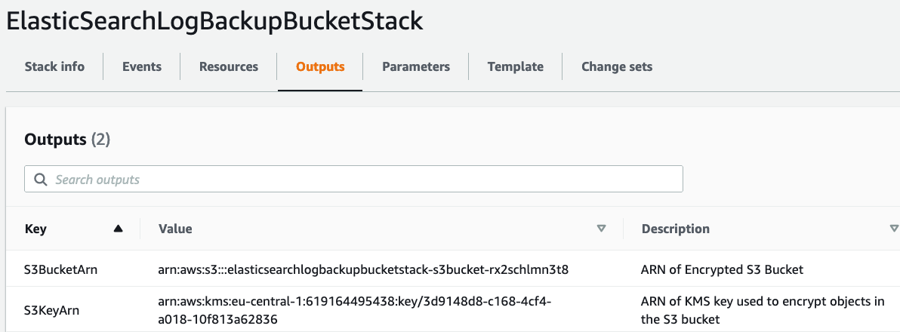

# About
This repository shows how to backup indices from ElasticSearch to Amazon S3 in the Amazon Cloud. [AWS CloudFormation](https://aws.amazon.com/cloudformation/) templates are provided to automate creation of an S3 bucket where the index backups will be stored as well as an EC2 instance with an Elastic Search installation to test hands-on.

# Preparation and Deployment
## S3 Bucket
Open up [CloudFormation in the AWS Console](https://console.aws.amazon.com/cloudformation) and click on **Create Stack** (with new resources). Select **Upload a template file** and select the [`s3bucket.yaml`](cloudformation/s3bucket.yaml) template provided in this repo. Click **Next**, enter a name for the stack (e.g. `es-bucket`), again click **Next** and create the stack.

Deployment will take a couple of minutes and will create an S3 bucket with [SSE-KMS](https://docs.aws.amazon.com/AmazonS3/latest/userguide/UsingKMSEncryption.html) default encryption enabled as well as a corresponding [KMS key](https://aws.amazon.com/kms/). Furthermore, an [S3 Lifecycle configuration](https://docs.aws.amazon.com/AmazonS3/latest/userguide/object-lifecycle-mgmt.html) is created to progressively move backups to colder storage tiers and eventually delete them.

After the stack finished deploying, select it in the console and review the **Outputs Tab**. It will show the [ARN](https://docs.aws.amazon.com/general/latest/gr/aws-arns-and-namespaces.html) of the S3 bucket and KMS key, as follows:
. Save these ARNs as we will need them for deploying the instance stack.

## EC2 Instance with ElasticSearch
Next, we deploy another stack what will


# Backup to S3
This example uses [ElasticSearch's Snapshot and Resore functionality](https://www.elastic.co/guide/en/elasticsearch/reference/8.4/snapshot-restore.html), leveraging [S3 to store the snapshot repository](https://www.elastic.co/guide/en/elasticsearch/reference/8.4/repository-s3.html).

## Backup to S3 Standard and S3 Intelligent Tiering Storage Class
### S3 Staddard
Setup a backup repository, get the bucket from the environment variable 
```shell
# Grab the name of the bucket from the environment variable and substitute it in the json below
echo $S3_BUCKET
curl -X PUT "localhost:9200/_snapshot/my_s3_repository_standard?pretty" -H 'Content-Type: application/json' -d'
{
  "type": "s3",
  "settings": {
    "bucket": "elasticsearchlogbackupbucketstack-s3bucket-rx2schlmn3t8",
    "base_path": "test-standard",
    "storage_class": "standard"
  }
}
'
Next, trigger creation of a snapshot
```shell
curl -X PUT "localhost:9200/_snapshot/my_s3_repository_standard/snapshot_1?wait_for_completion=true&pretty"
```
outputs
```json
{
  "snapshot" : {
    "snapshot" : "snapshot_1",
    "uuid" : "m6XYpAMRTlu75Dm0zRu7tQ",
    "repository" : "my_s3_repository_standard",
    "version_id" : 7160399,
    "version" : "7.16.3",
    "indices" : [
      ".geoip_databases",
      ".ds-.logs-deprecation.elasticsearch-default-2022.09.13-000001",
      "test_data"
    ],
    "data_streams" : [
      ".logs-deprecation.elasticsearch-default"
    ],
    "include_global_state" : true,
    "state" : "SUCCESS",
    "start_time" : "2022-09-13T16:17:56.703Z",
    "start_time_in_millis" : 1663085876703,
    "end_time" : "2022-09-13T16:18:03.105Z",
    "end_time_in_millis" : 1663085883105,
    "duration_in_millis" : 6402,
    "failures" : [ ],
    "shards" : {
      "total" : 3,
      "failed" : 0,
      "successful" : 3
    },
    "feature_states" : [
      {
        "feature_name" : "geoip",
        "indices" : [
          ".geoip_databases"
        ]
      }
    ]
  }
}
```
Now let's create a second snapshot:
```shell
curl -X PUT "localhost:9200/_snapshot/my_s3_repository_standard/snapshot_2?wait_for_completion=true&pretty"
```
Go to the S3 console and check the `test-standard` prefix in your bucket. All objects will be in the Standard storage class.

### S3 Intelligent 
Repeat the same steps process for the `intelligent-tiering` storage class with a repository base path of `test-it`:
```shell
# Grab the name of the bucket from the environment variable and substitute it in the json below
echo $S3_BUCKET
# Create repository
curl -X PUT "localhost:9200/_snapshot/my_s3_repository_it?pretty" -H 'Content-Type: application/json' -d'
{
  "type": "s3",
  "settings": {
    "bucket": "elasticsearchlogbackupbucketstack-s3bucket-rx2schlmn3t8",
    "base_path": "test-it",
    "storage_class": "intelligent_tiering"
  }
}
'
# Create first snapshot
curl -X PUT "localhost:9200/_snapshot/my_s3_repository_it/snapshot_1?wait_for_completion=true&pretty"
# Create second snapshot
curl -X PUT "localhost:9200/_snapshot/my_s3_repository_it/snapshot_2?wait_for_completion=true&pretty"
```
Notice how the second snapshot was created substantially faster.
Again checking the S3 console for the `test-it` prefix in your bucket, you find that all objects will be in the Intelligent Tiering storage class.

## Backup to Glacier  Storage classes
S3 glacier classes are [currenty not supported by ElasticSearch](https://www.elastic.co/guide/en/elasticsearch/reference/8.4/repository-s3.html#repository-s3-repository): 
>  Due to the extra complexity with the Glacier class lifecycle, it is not currently supported by this repository type.

This may change soon, as AWS released the [Instant Retrieval (IR) storage class](https://aws.amazon.com/about-aws/whats-new/2021/11/amazon-s3-glacier-instant-retrieval-storage-class) in November 2021, which simplifies the lifecycle because objects can be directly retrieved without [explicitly restoring](https://aws.amazon.com/premiumsupport/knowledge-center/restore-s3-object-glacier-storage-class/) them first. A [corresponing feature request exists in GitHub](https://github.com/elastic/elasticsearch/issues/81351).

It is worth pointing out though that Glacier IR brings the most cost savings for cold data blobs, while metadata blobs are typically frequently accessed when taking and deleting snapshots or otherwise interacting with the backup repository. There is a corresponding [feature request for this on GitHub](https://github.com/elastic/elasticsearch/issues/81352) that calls for separate storage class options for data and metadata storage to address this fact.

In a production setup, the Lifecycle rule configured for our backup bucket will automatically move objects to colder storage classes over the course of time. 

For the purpose of this example, we create another backup repository based on standard storage class, and manually move objects to Glacier classes with [AWS CLI](https://aws.amazon.com/cli/).

### Backup to S3 Glacier Instant Retrieval 
```shell
# Grab the name of the bucket from the environment variable and substitute it in the json below
echo $S3_BUCKET
curl -X PUT "localhost:9200/_snapshot/my_s3_repository_gir?pretty" -H 'Content-Type: application/json' -d'
{
  "type": "s3",
  "settings": {
    "bucket": "elasticsearchlogbackupbucketstack-s3bucket-rx2schlmn3t8",
    "base_path": "test-gir",
    "storage_class": "standard"
  }
}
'
Next, trigger a snapshot
```shell
curl -X PUT "localhost:9200/_snapshot/my_s3_repository_gir/snapshot_1?wait_for_completion=true&pretty"
```
outputs
```json
{
  "snapshot" : {
    "snapshot" : "snapshot_1",
    "uuid" : "WEiwI_10Q-qTwaPGwPfzSg",
    "repository" : "my_s3_repository_gir",
    "version_id" : 7160399,
    "version" : "7.16.3",
    "indices" : [
      ".ds-.logs-deprecation.elasticsearch-default-2022.09.13-000001",
      ".geoip_databases",
      "test_data"
    ],
    "data_streams" : [
      ".logs-deprecation.elasticsearch-default"
    ],
    "include_global_state" : true,
    "state" : "SUCCESS",
    "start_time" : "2022-09-13T21:51:05.270Z",
    "start_time_in_millis" : 1663105865270,
    "end_time" : "2022-09-13T21:51:11.672Z",
    "end_time_in_millis" : 1663105871672,
    "duration_in_millis" : 6402,
    "failures" : [ ],
    "shards" : {
      "total" : 3,
      "failed" : 0,
      "successful" : 3
    },
    "feature_states" : [
      {
        "feature_name" : "geoip",
        "indices" : [
          ".geoip_databases"
        ]
      }
    ]
  }
}
```
Now change the storage class of all the created objects with awscli:
```shell
aws s3 cp s3://$S3_BUCKET/test-gir/ s3://$S3_BUCKET/test-gir/ --recursive --storage-class GLACIER_IR
```
Let's create another snapshot:
```shell
curl -X PUT "localhost:9200/_snapshot/my_s3_repository_gir/snapshot_2?wait_for_completion=true&pretty"
```
This command succeeds. Inspecting the objects under the `test-gir` prefix in the bucket, you can see that new and updated objects are again created in the Standard storage class. You either need to move them manually again or wait for the Lifecycle configuration to transition them.

### Backup to Glacier Flexible Retrieval
For this example, we will follow the same process as for instant retrieval.

Notice you could also do the same for Glacier Deep Archive, but we go with Flexible Retrieval to speed up the restore. 
```shell
# Grab the name of the bucket from the environment variable and substitute it in the json below
echo $S3_BUCKET
# Create repository
curl -X PUT "localhost:9200/_snapshot/my_s3_repository_gfr?pretty" -H 'Content-Type: application/json' -d'
{
  "type": "s3",
  "settings": {
    "bucket": "elasticsearchlogbackupbucketstack-s3bucket-rx2schlmn3t8",
    "base_path": "test-gfr",
    "storage_class": "standard"
  }
}
'
# Create first snapshot
curl -X PUT "localhost:9200/_snapshot/my_s3_repository_gfr/snapshot_1?wait_for_completion=true&pretty"
# Move objects to Glacier Flexible Retrieval class
aws s3 cp s3://$S3_BUCKET/test-gfr/ s3://$S3_BUCKET/test-gfr/ --recursive --storage-class GLACIER
```
However, this time creating a second snapshot will fail:
```shell
# Create second snapshot
curl -X PUT "localhost:9200/_snapshot/my_s3_repository_gfr/snapshot_2?wait_for_completion=true&pretty"
```
with output
```json
{
  "snapshot" : {
    "snapshot" : "snapshot_2",
    "uuid" : "Cit3RW3eSiyc1Q1IEni7Qg",
    "repository" : "my_s3_repository_gfr",
    "version_id" : 7160399,
    "version" : "7.16.3",
    "indices" : [
      "test_data",
      ".ds-.logs-deprecation.elasticsearch-default-2022.09.13-000001",
      ".geoip_databases"
    ],
    "data_streams" : [
      ".logs-deprecation.elasticsearch-default"
    ],
    "include_global_state" : true,
    "state" : "PARTIAL",
    "start_time" : "2022-09-13T23:06:18.484Z",
    "start_time_in_millis" : 1663110378484,
    "end_time" : "2022-09-13T23:06:18.484Z",
    "end_time_in_millis" : 1663110378484,
    "duration_in_millis" : 0,
    "failures" : [
      {
        "index" : ".geoip_databases",
        "index_uuid" : "u80vJRWTTNWEWER0JV_q-w",
        "shard_id" : 0,
        "reason" : "AmazonS3Exception[The operation is not valid for the object's storage class (Service: Amazon S3; Status Code: 403; Error Code: InvalidObjectState; Request ID: FGQ5Z0MZTABT1HZD; S3 Extended Request ID: 4gxE5J10qTCv1WlZxOMe5pKN2MWCmukAiq1aSg3L0K1DrZbanSWEe2NRysnWk7hvj6jlXzsIFsM=)]",
        "node_id" : "2XNkLimMT_CD7GGiqJqnSw",
        "status" : "INTERNAL_SERVER_ERROR"
      },
      {
        "index" : ".ds-.logs-deprecation.elasticsearch-default-2022.09.13-000001",
        "index_uuid" : "Lpn3OgffRuahVtJYyNrGqg",
        "shard_id" : 0,
        "reason" : "AmazonS3Exception[The operation is not valid for the object's storage class (Service: Amazon S3; Status Code: 403; Error Code: InvalidObjectState; Request ID: FGQ94H46SHBT90DV; S3 Extended Request ID: TKZ5rdXwrWuV1B8xY3b4vyrm2xIAmWMKqjaVM62DDF+uEUSMWiZCcGdy/jDmErO/gQpgmiHuHt0=)]",
        "node_id" : "2XNkLimMT_CD7GGiqJqnSw",
        "status" : "INTERNAL_SERVER_ERROR"
      },
      {
        "index" : "test_data",
        "index_uuid" : "2e1LLXpRRBmKq9odssgWJw",
        "shard_id" : 0,
        "reason" : "AmazonS3Exception[The operation is not valid for the object's storage class (Service: Amazon S3; Status Code: 403; Error Code: InvalidObjectState; Request ID: FGQ7MV4SX2HRC4DE; S3 Extended Request ID: Nl73zBtCscaoBsvh9JtGwzELgWnerhKv2FsfE+e5YHZW3Pd2JjR0ndEEe9y7LtXCsOejPgaoHMQ=)]",
        "node_id" : "2XNkLimMT_CD7GGiqJqnSw",
        "status" : "INTERNAL_SERVER_ERROR"
      }
    ],
    "shards" : {
      "total" : 3,
      "failed" : 3,
      "successful" : 0
    },
    "feature_states" : [
      {
        "feature_name" : "geoip",
        "indices" : [
          ".geoip_databases"
        ]
      }
    ]
  }
}
```

## Restore Snapshots

### Restore from S3 Storage Classes or Glacier Instant Retrieval
```shell
curl -X POST "localhost:9200/_snapshot/my_s3_repository_standard/snapshot_2/_restore?wait_for_completion=true&pretty" -H 'Content-Type: application/json' -d'
{
  "indices": "test_data",
  "rename_pattern": "test_data",
  "rename_replacement": "test_data_restore_standard_s2"
}
'
```
succeeds with output
```json
{
  "snapshot" : {
    "snapshot" : "snapshot_2",
    "indices" : [
      "test_data_restore_standard_s2"
    ],
    "shards" : {
      "total" : 1,
      "failed" : 0,
      "successful" : 1
    }
  }
}
```
Checking the indices, we can see we now have an additional one
```shell
curl -X GET "localhost:9200/_cat/indices?v"
health status index                         uuid                   pri rep docs.count docs.deleted store.size pri.store.size
green  open   .geoip_databases              u80vJRWTTNWEWER0JV_q-w   1   0         41            0     38.7mb         38.7mb
yellow open   test_data_restore_standard_s2 ewm33w0jRWesJJwmKu10Hw   1   1    2600000            0    200.3mb        200.3mb
yellow open   test_data                     2e1LLXpRRBmKq9odssgWJw   1   1    2600000            0    200.3mb        200.3mb
```
Similarly, you can restore for other S3 storage classes. 

We can also restore for Glacier IR in the same manner
```shell
curl -X POST "localhost:9200/_snapshot/my_s3_repository_gir/snapshot_1/_restore?wait_for_completion=true&pretty" -H 'Content-Type: application/json' -d'
{
  "indices": "test_data",
  "rename_pattern": "test_data",
  "rename_replacement": "test_data_restore_gir_s1"
}
'
```
```json
{
  "snapshot" : {
    "snapshot" : "snapshot_1",
    "indices" : [
      "test_data_restore_gir_s1"
    ],
    "shards" : {
      "total" : 1,
      "failed" : 0,
      "successful" : 1
    }
  }
}
```
```shell
curl -X GET "localhost:9200/_cat/indices?v"
health status index                         uuid                   pri rep docs.count docs.deleted store.size pri.store.size
green  open   .geoip_databases              u80vJRWTTNWEWER0JV_q-w   1   0         41            0     38.7mb         38.7mb
yellow open   test_data_restore_standard_s2 ewm33w0jRWesJJwmKu10Hw   1   1    2600000            0    200.3mb        200.3mb
yellow open   test_data                     2e1LLXpRRBmKq9odssgWJw   1   1    2600000            0    200.3mb        200.3mb
yellow open   test_data_restore_gir_s1      FcAJCfxcQ9WSh3P92wfffw   1   1    2600000            0    200.3mb        200.3mb
```

## Restore from Glacier Flexible Retrieval (and Deep Archive)
For the traditional Glacier Classes (Flexible Retrieval and Deep Archive), direct restore fails however:
```shell
curl -X POST "localhost:9200/_snapshot/my_s3_repository_gfr/snapshot_1/_restore?wait_for_completion=true&pretty" -H 'Content-Type: application/json' -d'
{
  "indices": "test_data",
  "rename_pattern": "test_data",
  "rename_replacement": "test_data_restore_gfr_s1"
}
'
```
```json
{
  "error" : {
    "root_cause" : [
      {
        "type" : "snapshot_exception",
        "reason" : "[my_s3_repository_gfr:snapshot_1/7RywMn5mQT2Je91ZRkSaAQ] Snapshot could not be read"
      }
    ],
    "type" : "snapshot_exception",
    "reason" : "[my_s3_repository_gfr:snapshot_1/7RywMn5mQT2Je91ZRkSaAQ] Snapshot could not be read",
    "caused_by" : {
      "type" : "amazon_s3_exception",
      "reason" : "The operation is not valid for the object's storage class (Service: Amazon S3; Status Code: 403; Error Code: InvalidObjectState; Request ID: 77C8J793RSA8RHBA; S3 Extended Request ID: bXBayY7JRTf1+xfULK4azszyNYV9qfcrBBq21hVf3Jyfvx3XmpEEakVq+8NSq2Wk+U3et6i/T9I=)"
    }
  },
  "status" : 500
}
```
In order to restore the snapshot, we first need to restore the objects backing it in S3 to a storage class that can be directly retrieved. We use the [`aws-s3-glacier-restore`](https://github.com/marko-bast/aws-s3-glacier-restore) utility, whichs wraps the [RestoreObject API](https://aws.amazon.com/premiumsupport/knowledge-center/restore-s3-object-glacier-storage-class/), providing a convenient way to restore recursively all objects in a prefix:
```shell
pip3 install  aws-s3-glacier-restore
export PATH=$PATH:/usr/local/bin
aws-s3-glacier-restore -p s3://$S3_BUCKET/test-gfr -d 14
```
Select Option 1 for expedited retrieval.
Checking the `test-gfr` prefix in our bucket, we see how objects are being restored. Since we selected expedited mode and we restore only a couple hundred MBs, this should finish within 1-5 minutes.
Check the status in the console and restore the index subsequently
```shell
curl -X POST "localhost:9200/_snapshot/my_s3_repository_gfr/snapshot_1/_restore?wait_for_completion=true&pretty" -H 'Content-Type: application/json' -d'
{
  "indices": "test_data",
  "rename_pattern": "test_data",
  "rename_replacement": "test_data_restore_gfr_s1"
}
'
```
```json
{
  "snapshot" : {
    "snapshot" : "snapshot_1",
    "indices" : [
      "test_data_restore_gfr_s1"
    ],
    "shards" : {
      "total" : 1,
      "failed" : 0,
      "successful" : 1
    }
  }
}
```
```shell
url -X GET "localhost:9200/_cat/indices?v"
health status index                         uuid                   pri rep docs.count docs.deleted store.size pri.store.size
green  open   .geoip_databases              u80vJRWTTNWEWER0JV_q-w   1   0         41            0     38.7mb         38.7mb
yellow open   test_data_restore_standard_s2q ewm33w0jRWesJJwmKu10Hw   1   1    2600000            0    200.3mb        200.3mb
yellow open   test_data_restore_gfr_s1      sdMcBAluS4WZv7LqAKLwVA   1   1    2600000            0    200.3mb        200.3mb
yellow open   test_data                     2e1LLXpRRBmKq9odssgWJw   1   1    2600000            0    200.3mb        200.3mb
yellow open   test_data_restore_gir_s1      FcAJCfxcQ9WSh3P92wfffw   1   1    2600000            0    200.3mb        200.3mb
```

# IAM Permissions
From your ElasticSearch instance, download all files on particular prefix, e.g.
```bash
aws s3 cp --recursive  s3://$S3_BUCKET/test-standard /tmp/test-standard
```
This will download all objects in the `test-standard`prefix into a directory on the local file system.

This worked, because thus far, our ElasticSearch EC2 instance had all the required permissions to access the S3 bucket as well as the KMS key configured to encrypt objects in that bucket. The same holds true for interactions triggered via the ElasticSearch API.

Navigate now to [IAM Roles](https://console.aws.amazon.com/iamv2/home#/roles) in your AWS Console and Search for `ElasticSearchInstanceRole`. Select the Role and review the Permission Policies. Now delete the `AccessToKmsKey` Permission policy from the role and try again the same command to download the files. This time, you will receive an error because you no longer have access to the KMS key required to decrypt the objects prior to download:
```
An error occurred (AccessDenied) when calling the GetObject operation: The ciphertext refers to a customer master key that does not exist, does not exist in this region, or you are not allowed to access.
```

# Conclusion
We showed how ElasticSearch data can be saved to and restored seaminglessly to S3 with S3 Storage classes. 

The new Glacier Instant Retrieval Class is similar to S3 Storage classes in that we can instantly access objects, though ElasticSearch does not yet directly support it and we need to tranistion objects either manually or via lifecycle rules.

Conventional Glacier Classes (Glacier Flexible Retrieval and Glacier Deep Archive) have limited functionality for incremental snapshots as they require objects to be restored prior to retrieval.

We also showcased how S3 SSE-KMS Encryption can add an additional layer of protection to your data, and discussed relevant IAM permissions.

